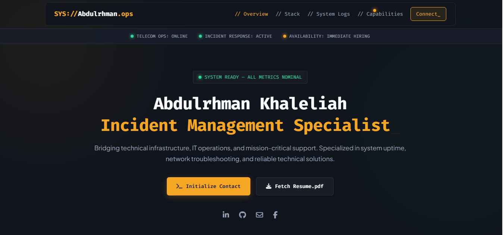

# Abdulrhman Khaleliah - Portfolio
## Portfolio Preview

## Overview

This is my personal portfolio website designed to showcase my technical skills, projects, and professional journey in Computer Systems Engineering and IT Operations.

The website presents my experience in technical support, software development, and web technologies.

## Features

- Responsive design for desktop and mobile devices
- Modern and clean user interface
- Projects showcase
- Skills and technologies section
- Professional experience section
- Contact information and social links

## Technologies Used

- HTML5
- CSS3
- JavaScript
- Responsive Web Design

## Project Structure
Portofolio/
│
├── index.html
├── style.css
├── script.js
├── images/
├── .github/
│ └── workflows/
├── CV.pdf
├── Capture.PNG
└── README.md
